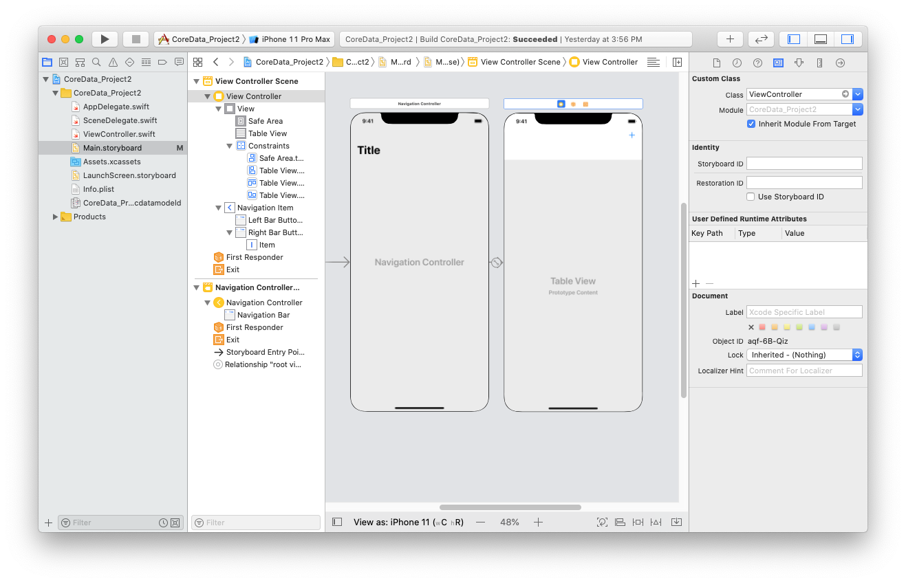

# Create ToDo List using Core Data


* CoreData
* Alert Controller with textFeild


> Create Single view Xcode Project, Must check core Data option.
> View Controller embed in Navigation controller from Editor menu in Main Storyboard
> Add Table view to View Controller, Make Title bigger, insert (+/ADD) bar button item, ensure tableView datasoure to the controller form 
> go to CoreData.xcdatamodeld file add an entity rename to "Person", add an Attributes: "name"
> Add one outlet of table view and one BarButtonAction from (+/Add) Button
> Write those following code over the View Controller


```swift
import UIKit
import CoreData

class ViewController: UIViewController {

    @IBOutlet weak var tableView: UITableView!
//    var names: [String] = []
    var people: [NSManagedObject] = []
    override func viewDidLoad() {
        super.viewDidLoad()
        tableView.register(UITableViewCell.self, forCellReuseIdentifier: "cell")
         title = "The List"
//        tableView.delegate = self
//        tableView.dataSource = self
    }
    
    @IBAction func addName(_ sender: UIBarButtonItem) {
        
        let alert = UIAlertController(title: "Add New", message: "Add new names", preferredStyle: .alert)
        let saveAction = UIAlertAction(title: "Save", style: .default, handler: {[unowned self] action in
            guard let namesTextField = alert.textFields?.first, let namesToSave = namesTextField.text else{
                return
            }
//            self.names.append(namesToSave)
            self.saveNameToCoreData(name: namesToSave)
            self.tableView.reloadData()
        })
       let cancelAction = UIAlertAction(title: "cancel", style: .cancel, handler: nil)
        alert.addTextField()
        alert.addAction(saveAction)
        alert.addAction(cancelAction)
        present(alert, animated: true)
    }
    private func saveNameToCoreData(name: String){
        guard let appDelegate = UIApplication.shared.delegate as? AppDelegate else{ return }
        let managedContext = appDelegate.persistentContainer.viewContext
        guard let personEntity = NSEntityDescription.entity(forEntityName: "Person", in: managedContext) else{
            return
        }
        let personObject = NSManagedObject(entity: personEntity, insertInto: managedContext)
        personObject.setValue(name, forKey: "name")
        do{
            try managedContext.save()
            people.append(personObject)
        }catch let error as NSError{
            print("Could not saved: \(error), \(error.userInfo)")
        }
    }
    override func viewWillAppear(_ animated: Bool) {
        super.viewWillAppear(true)
        guard let appDelegate = UIApplication.shared.delegate as? AppDelegate else{ return }
        let managedContext = appDelegate.persistentContainer.viewContext
        //guard let personEntity = NSEntityDescription.entity(forEntityName: "Person", in: managedContext) else{ return }
       // let personObject = NSManagedObject.init(entity: personEntity, insertInto: managedContext)
        let fetchPersonObject = NSFetchRequest<NSManagedObject>(entityName: "Person")
        do {
            people = try managedContext.fetch(fetchPersonObject)
          } catch let error as NSError {
            print("Could not fetch. \(error), \(error.userInfo)")
          }
    }
}

extension ViewController: UITableViewDelegate, UITableViewDataSource{
    func tableView(_ tableView: UITableView, numberOfRowsInSection section: Int) -> Int {
        
//        return self.names.count
        return self.people.count
    }
    
    func tableView(_ tableView: UITableView, cellForRowAt indexPath: IndexPath) -> UITableViewCell {
        let person = people[indexPath.row]
        let cell = tableView.dequeueReusableCell(withIdentifier: "cell", for: indexPath)
//        cell.textLabel?.text = names[indexPath.row]
        cell.textLabel?.text = person.value(forKeyPath: "name") as? String
        return cell
        
    }
    
    
}

```


