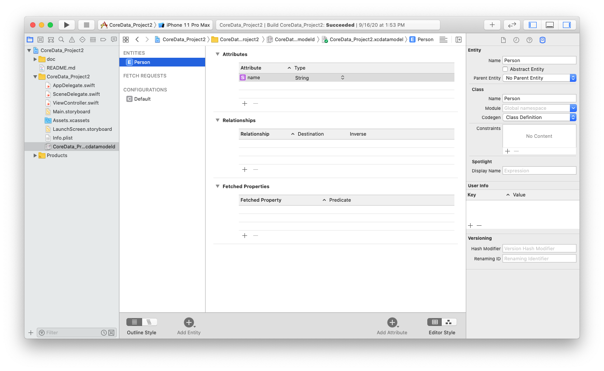
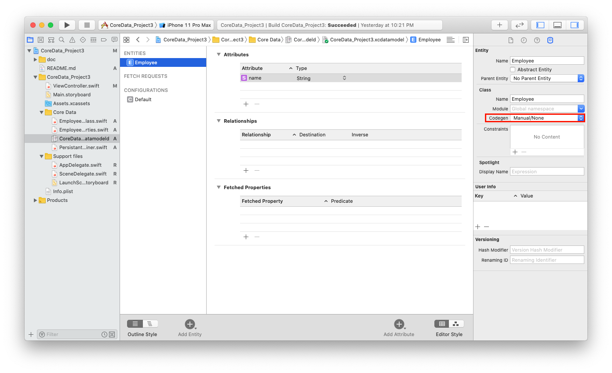
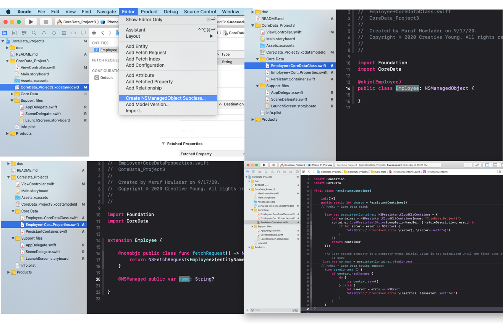
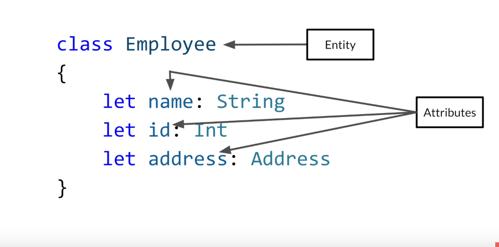

# Create ToDo List using Core Data


> CoreData
> Alert Controller with textFeild


* Create Single view Xcode Project, Must check core Data option.
* View Controller embed in Navigation controller from Editor menu in Main Storyboard
* Add Table view to View Controller, Make Title bigger, insert (+/ADD) bar button item, ensure tableView datasoure to the controller form 
* go to CoreData.xcdatamodeld file add an entity rename to "Person", add an Attributes: "name"
* Add one outlet of table view and one BarButtonAction from (+/Add) Button
* Write those following code over the View Controller




```swift
import UIKit
import CoreData

class ViewController: UIViewController {

    @IBOutlet weak var tableView: UITableView!
//    var names: [String] = []
    var people: [NSManagedObject] = []
    override func viewDidLoad() {
        super.viewDidLoad()
        tableView.register(UITableViewCell.self, forCellReuseIdentifier: "cell")
         title = "The List"
//        tableView.delegate = self
//        tableView.dataSource = self
    }
    
    @IBAction func addName(_ sender: UIBarButtonItem) {
        
        let alert = UIAlertController(title: "Add New", message: "Add new names", preferredStyle: .alert)
        let saveAction = UIAlertAction(title: "Save", style: .default, handler: {[unowned self] action in
            guard let namesTextField = alert.textFields?.first, let namesToSave = namesTextField.text else{
                return
            }
//            self.names.append(namesToSave)
            self.saveNameToCoreData(name: namesToSave)
            self.tableView.reloadData()
        })
       let cancelAction = UIAlertAction(title: "cancel", style: .cancel, handler: nil)
        alert.addTextField()
        alert.addAction(saveAction)
        alert.addAction(cancelAction)
        present(alert, animated: true)
    }
    private func saveNameToCoreData(name: String){
        guard let appDelegate = UIApplication.shared.delegate as? AppDelegate else{ return }
        let managedContext = appDelegate.persistentContainer.viewContext
        guard let personEntity = NSEntityDescription.entity(forEntityName: "Person", in: managedContext) else{
            return
        }
        let personObject = NSManagedObject(entity: personEntity, insertInto: managedContext)
        personObject.setValue(name, forKey: "name")
        do{
            try managedContext.save()
            people.append(personObject)
        }catch let error as NSError{
            print("Could not saved: \(error), \(error.userInfo)")
        }
    }
    override func viewWillAppear(_ animated: Bool) {
        super.viewWillAppear(true)
        guard let appDelegate = UIApplication.shared.delegate as? AppDelegate else{ return }
        let managedContext = appDelegate.persistentContainer.viewContext
        //guard let personEntity = NSEntityDescription.entity(forEntityName: "Person", in: managedContext) else{ return }
       // let personObject = NSManagedObject.init(entity: personEntity, insertInto: managedContext)
        let fetchPersonObject = NSFetchRequest<NSManagedObject>(entityName: "Person")
        do {
            people = try managedContext.fetch(fetchPersonObject)
          } catch let error as NSError {
            print("Could not fetch. \(error), \(error.userInfo)")
          }
    }
}

extension ViewController: UITableViewDelegate, UITableViewDataSource{
    func tableView(_ tableView: UITableView, numberOfRowsInSection section: Int) -> Int {
        
//        return self.names.count
        return self.people.count
    }
    
    func tableView(_ tableView: UITableView, cellForRowAt indexPath: IndexPath) -> UITableViewCell {
        let person = people[indexPath.row]
        let cell = tableView.dequeueReusableCell(withIdentifier: "cell", for: indexPath)
//        cell.textLabel?.text = names[indexPath.row]
        cell.textLabel?.text = person.value(forKeyPath: "name") as? String
        return cell
        
    }
    
    
}

```


# Core Data
Codegen: Manual/None

### Steps
1. In this process we need to create external CoreData managed object subclass with properties. For this select projectName.xcmodeld, then select Entity name say Employee, change Codegen: Manual/None and goto EDIT->Create ManagedObjectSubclass. Its will create two file Employee+CoreDataClass and Employee+CoreDataProperties which contains a fetch function of our Model Employee and Model all propertise.
2. Now cut CoreData related code from Appdelegate, Create PersistantManager subclass and past over there, create a static let constant "shared" for access this class from other class.
3. Change save function from sceenDelegate. 
4. Write following code to the ViewController.





### Codes	
**SceneDelegate.swift**

```swift
func sceneDidEnterBackground(_ scene: UIScene) {
  PersistantContainer.shared.saveContext()
    }
```
**PersistantContainer.swift**

```swift
import Foundation
import CoreData

final class PersistantContainer{
    
    init(){}
    public static let shared = PersistantContainer()
    // MARK: - Core Data stack

      lazy var persistentContainer: NSPersistentCloudKitContainer = {
          let container = NSPersistentCloudKitContainer(name: "CoreData_Project3")
          container.loadPersistentStores(completionHandler: { (storeDescription, error) in
              if let error = error as NSError? {
                  fatalError("Unresolved error \(error), \(error.userInfo)")
              }
          })
          return container
      }()

      //A lazy stored property is a property whose initial value is not calculated until the first time it is used
     lazy var context = persistentContainer.viewContext
    // MARK: - Core Data Saving support
      func saveContext () {
          if context.hasChanges {
              do {
                  try context.save()
              } catch {
                  let nserror = error as NSError
                  fatalError("Unresolved error \(nserror), \(nserror.userInfo)")
              }
          }
      }
}

```

**Employee+CoreDataClass.swift**

```swift
import Foundation
import CoreData

@objc(Employee)
public class Employee: NSManagedObject {

}
```
    
**Employee+CoreDataProperties.swift**

```swift
import Foundation
import CoreData


extension Employee {

    @nonobjc public class func fetchRequest() -> NSFetchRequest<Employee> {
        return NSFetchRequest<Employee>(entityName: "Employee")
    }

    @NSManaged public var name: String?

}
```  

**PersistantContainer.swift**

```swift
import Foundation
import CoreData

final class PersistantContainer{
    
    init(){}
    public static let shared = PersistantContainer()
    // MARK: - Core Data stack

      lazy var persistentContainer: NSPersistentCloudKitContainer = {
          let container = NSPersistentCloudKitContainer(name: "CoreData_Project3")
          container.loadPersistentStores(completionHandler: { (storeDescription, error) in
              if let error = error as NSError? {
                  fatalError("Unresolved error \(error), \(error.userInfo)")
              }
          })
          return container
      }()

      //A lazy stored property is a property whose initial value is not calculated until the first time it is used
     lazy var context = persistentContainer.viewContext
    // MARK: - Core Data Saving support
      func saveContext () {
          if context.hasChanges {
              do {
                  try context.save()
              } catch {
                  let nserror = error as NSError
                  fatalError("Unresolved error \(nserror), \(nserror.userInfo)")
              }
          }
      }
}
``` 

**ViewController.swift**

```swift
import UIKit

class ViewController: UIViewController {

    override func viewDidLoad() {
        super.viewDidLoad()
//        createEmployee()
       fetchEmployee()
    }

    func createEmployee(){
               let employee = Employee(context: PersistantContainer.shared.context)
               employee.name = "Maruf"
               PersistantContainer.shared.saveContext()
           }
           func fetchEmployee(){
               do{
                guard let employee = try PersistantContainer.shared.context.fetch(Employee.fetchRequest()) as? [Employee] else { return }
//                print("Employees are : \( employee)")
                employee.forEach{debugPrint($0.name!)}
               }catch let error as NSError{
                   print("Could not fetch employee: \(error), \(error.userInfo)")
               }
            let path = FileManager.default.urls(for: .documentDirectory, in: .userDomainMask)
            debugPrint(path[0])
           }
    //let predicate = NSPredicate(format: "id==%@", id as CVarArg)
}
```

## Defination In One Word
* **Entity: Model** (Data Structure)
* **Attributes: Properties** (of Model)
* **Context: Connection** (to model)
* **NSManagedObject: Managed/Implrement relationship/behavior** (of data model object)
* **Container : Address** ( of Core Data Framework)

